# TryHackMe Portfolio

This section documents my hands-on cybersecurity learning using TryHackMe.

🔗 TryHackMe Profile:
(https://tryhackme.com/p/idamavothuke)

## 1 🦠 Malware Classification Lab – TryHackMe

This lab focused on identifying, analyzing, and classifying different types of malware based on real-world security alerts and behavioral indicators. The exercise simulated a SOC analyst workflow where alerts were reviewed and mapped to the correct malware category.

### 🔍 Skills Demonstrated
- Malware identification and classification
- Security alert analysis
- Behavioral analysis of malicious processes
- Understanding malware characteristics and attack patterns
- SOC investigation workflow

### 🛠 Concepts Covered
- Ransomware
- Spyware
- Worms
- Trojans
- Wiper Malware
- Command and Control (C2) Malware
- Binary vs Script-based malware

### 📌 Key Activities
- Reviewed suspicious process alerts
- Investigated malicious network behavior
- Classified malware based on observed indicators
- Identified persistence, data exfiltration, and destructive behaviors
- Completed hands-on malware classification exercises in a simulated SOC environment

### 🎯 Outcome
Successfully completed the TryHackMe Malware Classification room and correctly identified multiple malware categories using real-world alert scenarios and threat behavior analysis.

### 📊 Evidence & of Malware Classification

<h3 align="center">Room completion overview</h3>

    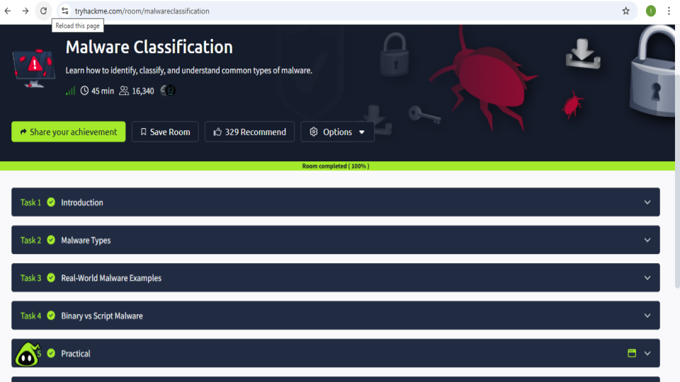

<h3 align="center">Practical malware classification dashboard</h3>

    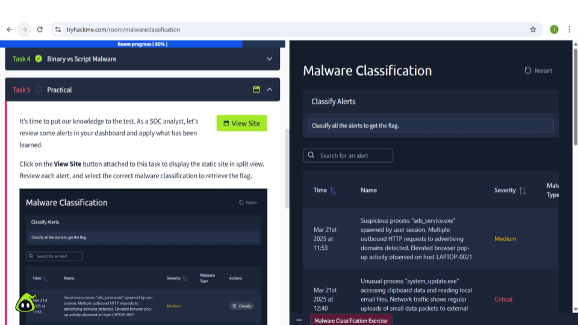

<h3 align="center">Correct alert classifications and flag retrieval</h3>

    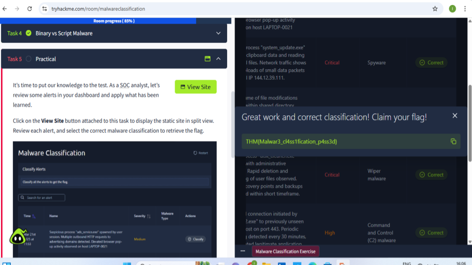

All screenshots arae here:

🔗 [Google Slides ](https://docs.google.com/presentation/d/1oGtoFZj4_46ktPl9t475m_ee-qzv_21FFWjFs0hlZnw/edit?usp=sharing)

## 2 🔵 Junior Security Analyst Intro – TryHackMe

This lab provided an introduction to the daily responsibilities of a Junior Security Analyst within a Security Operations Center (SOC). The exercise simulated real-world SOC workflows including alert monitoring, IP investigation, incident escalation, and firewall mitigation.

### 🔍 Skills Demonstrated
- SIEM dashboard monitoring
- Security alert investigation
- Threat intelligence and IP reputation analysis
- Incident escalation procedures
- Firewall management and malicious IP blocking
- SOC analyst decision-making workflow

### 🛠 Tools & Concepts Covered
- SIEM Dashboard Analysis
- IP Reputation Investigation
- Incident Escalation
- Firewall Rule Management
- Authentication Attack Detection
- SSH Brute-force Monitoring
- Security Operations Center (SOC) Workflow

### 📌 Key Activities
- Reviewed critical security alerts from a SIEM dashboard
- Investigated suspicious IP addresses using an IP Hunter tool
- Identified malicious authentication attempts
- Escalated security incidents to the appropriate SOC team member
- Blocked malicious IP addresses through a simulated firewall interface
- Applied basic incident response procedures in a simulated environment

### 🎯 Outcome
Successfully completed the Junior Security Analyst Intro room by analyzing suspicious login activity, investigating malicious IP addresses, escalating incidents properly, and implementing firewall mitigation actions.

### 📊 Evidence & of Security Information and Event Management (SIEM)

<h3 align="center">Room completion overview</h3>

    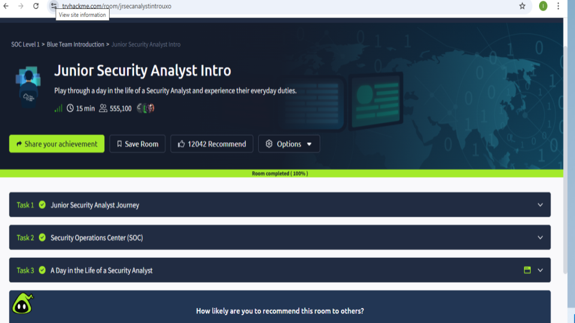

<h3 align="center">SIEM dashboard alert investigation</h3>

    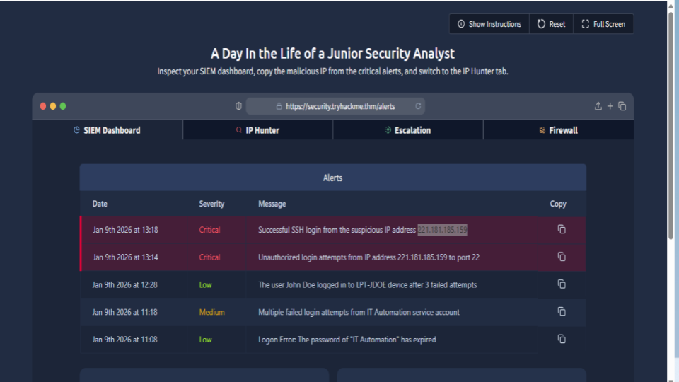

<h3 align="center">IP reputation analysis</h3>

    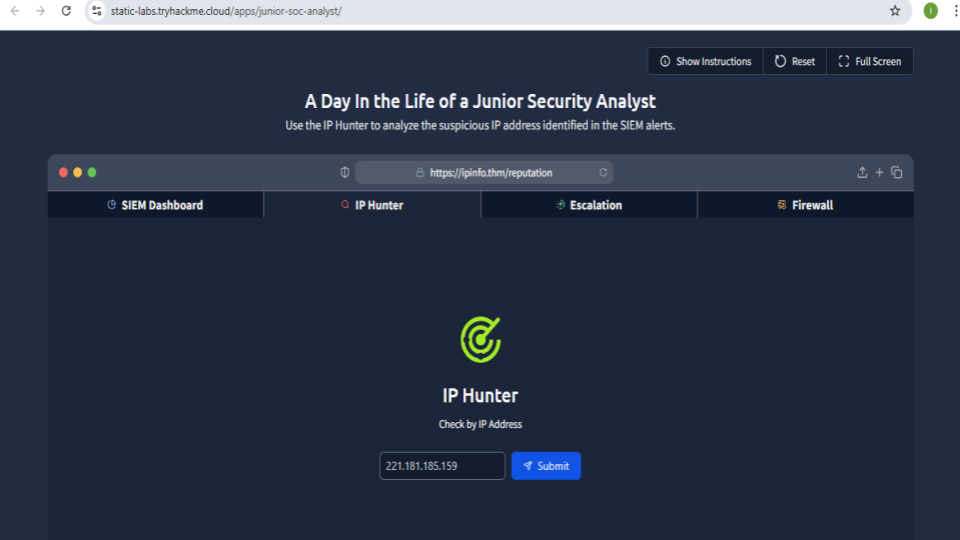

<h3 align="center">Incident escalation workflow</h3>

    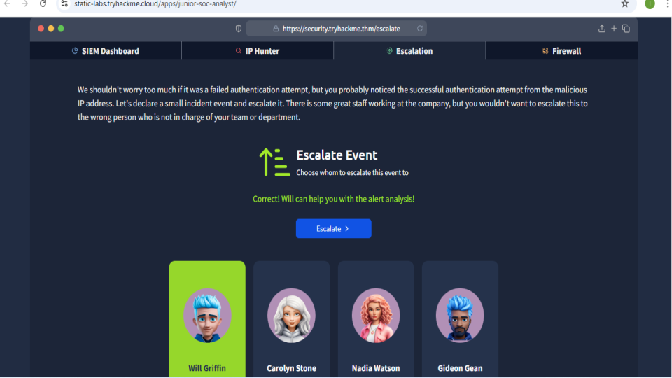

<h3 align="center">Firewall IP blocking configuration</h3>

    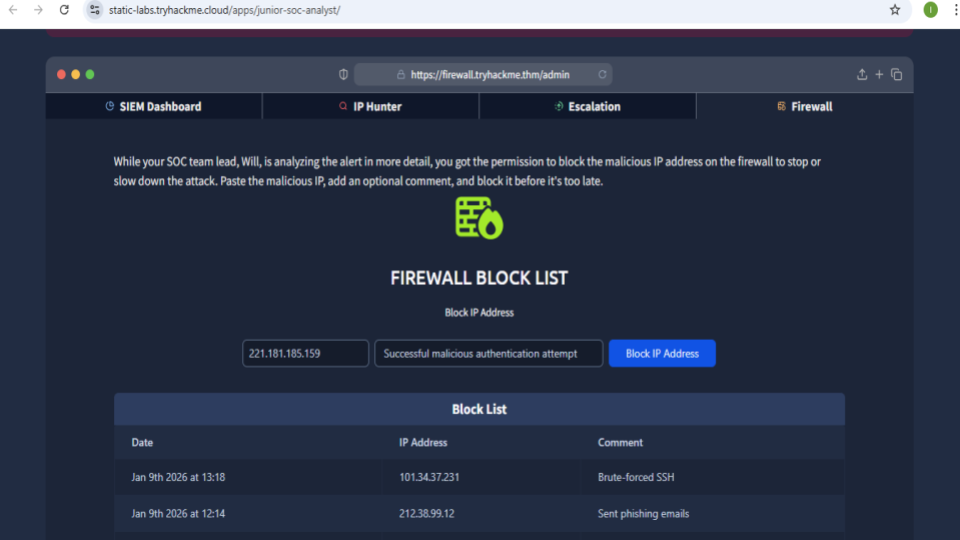

<h3 align="center">Successful mitigation and flag retrieval</h3>

    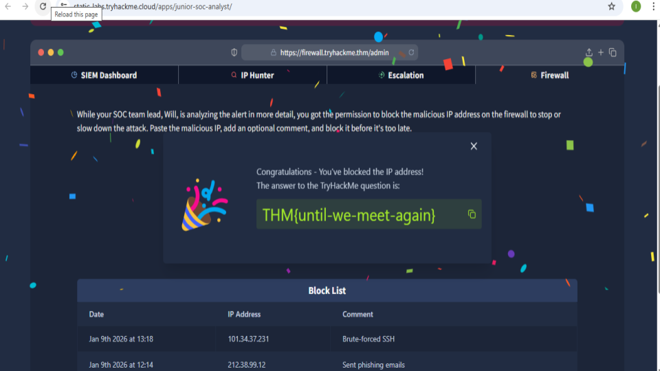

All screenshots arae here:

🔗 [Google Slides](https://docs.google.com/presentation/d/13TIrvURyyss5FUqHMBhnYUA0HERyD5rFDtSKCvpJg-c/edit?usp=sharing)

## 3 🛡 SOC Simulator – TryHackMe

This hands-on SOC Simulator lab provided practical experience in handling real-world cybersecurity incidents within a simulated Security Operations Center (SOC) environment. The exercise focused on alert triage, SIEM investigation, phishing analysis, incident reporting, and SOC performance monitoring.

### 🔍 Skills Demonstrated
- Security alert triage and investigation
- Phishing detection and analysis
- SIEM log analysis using Splunk
- Incident classification and reporting
- Threat detection and validation
- SOC workflow and case management
- False positive vs true positive analysis

### 🛠 Tools & Technologies
- Splunk SIEM
- SOC Alert Queue
- Incident Case Reporting
- Threat Investigation Dashboard
- Security Monitoring & Metrics

### 📌 Key Activities
- Reviewed and prioritized incoming security alerts
- Investigated phishing-related incidents in a simulated SOC environment
- Analyzed Windows event logs and registry activity in Splunk
- Differentiated between true positives and false positives
- Documented investigation findings in incident reports
- Recommended containment and remediation actions
- Monitored SOC performance metrics including MTTR and dwell time

### 🚨 Threat Scenarios Covered
- Phishing emails
- Suspicious external communications
- PowerShell-related suspicious activity
- Registry modifications
- Potential malware execution indicators
- Security incident escalation workflows

### 🎯 Outcome
Successfully completed the SOC Simulator exercises by investigating security alerts, performing SIEM-based log analysis, documenting incident findings, and applying real-world SOC analyst workflows in a simulated enterprise environment.

### 📊 Evidence

<h3 align="center">SOC Simulator dashboard overview</h3>

    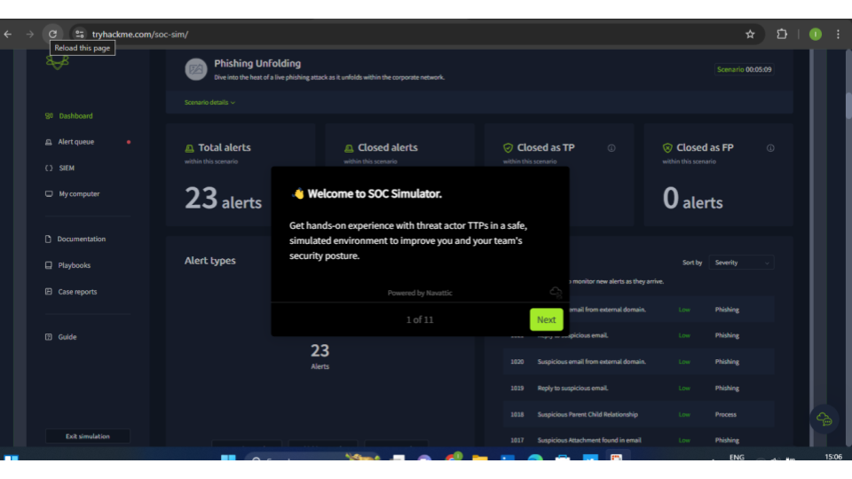

<h3 align="center">Alert queue and phishing investigation</h3>

    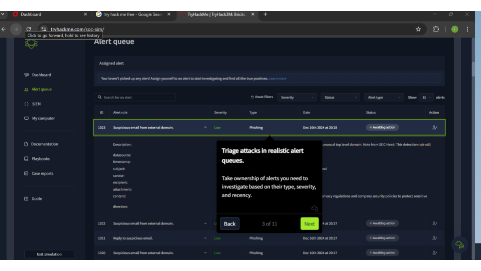

<h3 align="center">Splunk event log analysis</h3>

    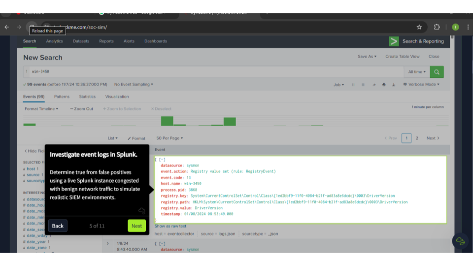

<h3 align="center">Incident report documentation</h3>

    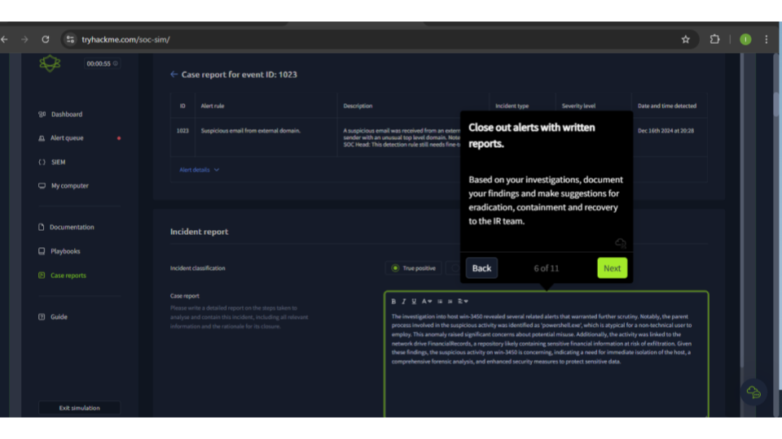

<h3 align="center">SOC performance and KPI tracking</h3>

    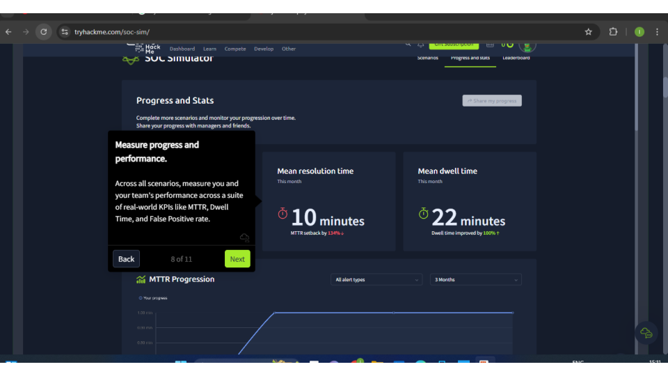

All screenshots are here:

🔗 [Google Slides](https://docs.google.com/presentation/d/1XFwUpTN0iyRwHCtfWE7rNq1WYIQ39aPdYYDjB3RNlz8/edit?usp=sharing)

## 4 🎯 Threat Hunting Simulator – TryHackMe

This hands-on Threat Hunting Simulator lab focused on identifying, correlating, and investigating malicious activity across a simulated enterprise environment. The exercise provided practical experience in threat hunting workflows, SIEM investigations, attack chain analysis, and documentation of security findings.

### 🔍 Skills Demonstrated
- Threat hunting and investigation
- SIEM log analysis
- Attack chain reconstruction
- Event correlation and timeline analysis
- Threat intelligence utilization
- Incident documentation and reporting
- Security monitoring and forensic analysis

### 🛠 Tools & Technologies
- Splunk SIEM
- Threat Intelligence Dashboard
- Timeline Analysis
- Threat Reporting System
- Security Event Correlation
- Windows Event Log Investigation

### 📌 Key Activities
- Investigated suspicious activity using threat intelligence data
- Reviewed enterprise documentation and network information
- Analyzed Windows Sysmon logs within Splunk
- Correlated multiple events to uncover attacker behavior
- Reconstructed attack timelines and attack stages
- Identified indicators of compromise (IOCs)
- Documented findings and security observations throughout the investigation

### 🚨 Threat Hunting Concepts Covered
- Initial Access
- PowerShell Execution Analysis
- Command and Control (C2) Activity
- Persistence Techniques
- Attack Timeline Reconstruction
- Event Correlation
- IOC Analysis
- Threat Actor Investigation

### 🎯 Outcome
Successfully completed the Threat Hunting Simulator by analyzing suspicious activity, correlating security events, reconstructing the attack chain, and documenting findings through a simulated enterprise threat hunting workflow.

### 📊 Evidence

<h3 align="center">Threat Hunting Simulator overview</h3>

    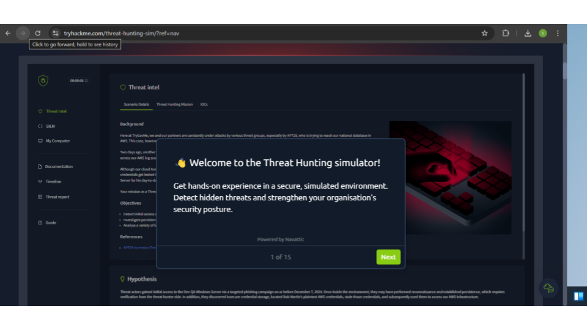

<h3 align="center">Threat intelligence investigation</h3>

    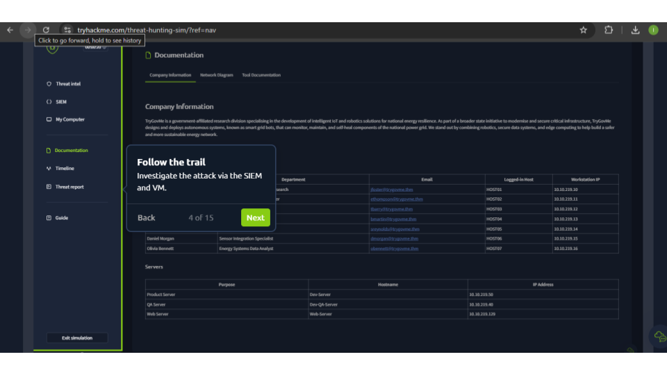

<h3 align="center">Enterprise documentation review</h3>

    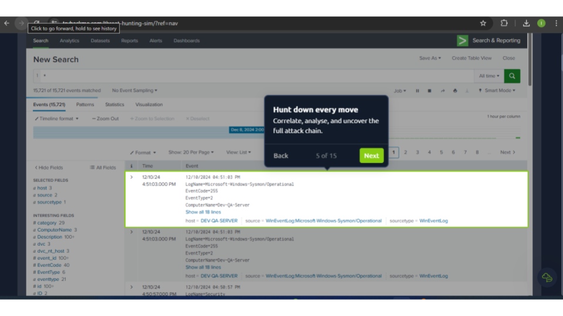

<h3 align="center">Attack timeline reconstruction</h3>

    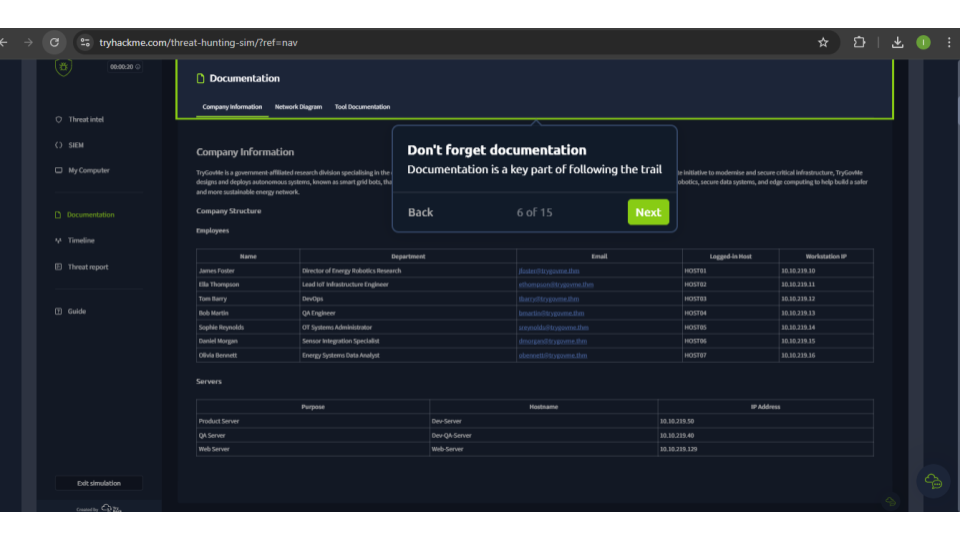

<h3 align="center">Threat hunting workflow and documentation</h3>

    

All screenshots are here:

🔗 [Google Slides ](https://docs.google.com/presentation/d/19chx-IR2GUGK7tadmLCWfOuRlI4xlZAvsL656L_hCUI/edit?usp=sharing)

This document contains evidence of hands-on threat hunting.

